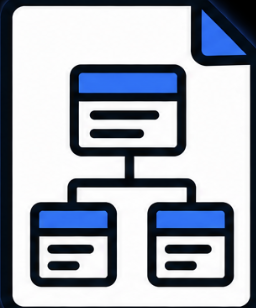
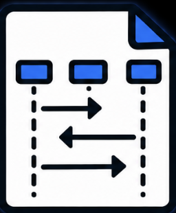

# HurricaneRescue_NervResponse
Hurricane prone areas often face recurring and life-threatening challenges during storm events, for example finding safe shelters and connecting people who need assistance with people that are willing to give it to them. Even though public shelter information is easily found online, it is hard to know if it offers medical services and if it has space left for more people. That is some of the reasons that we wanted to create an app/website that allows residents to **locate the nearest shelter** from their current location, allows them to see if it still has available space left, and if it has medical services on site. It would also allow citizens to **request help** if needed and for volunteers to assist by signing up to respond. This application would allow us to **reduce the time for first responders** and help people get to safety faster.

## Requirements

<a href="docs/requirements.pdf">Requirements Spreadsheet</a>

## Code Class Diagram

<a href="docs/uml-class-diagram.pdf">UML Class Diagram</a>
 

<a href="docs/uml-sequence-diagram1.pdf">UML Sequence Diagram 1</a>
 

<a href="docs/uml-sequence-diagram2.pdf">UML Sequence Diagram 2</a>